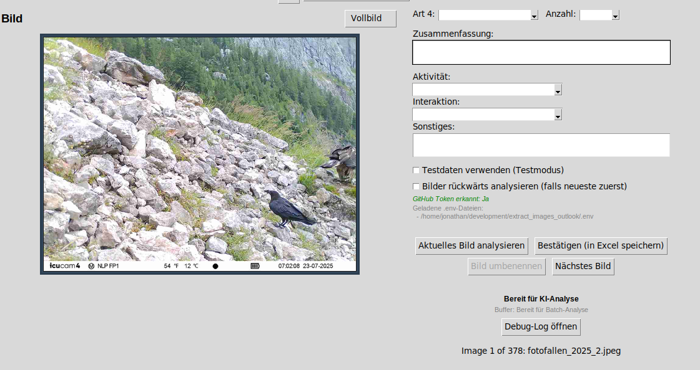
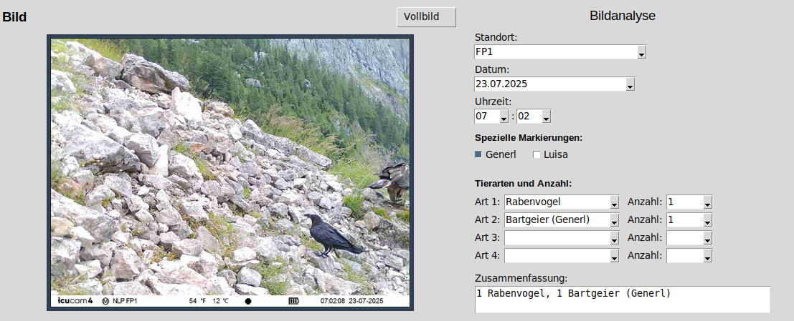

# 🦅 Kamerafallen-Tools

> AI-powered camera trap image analysis for wildlife conservation

Analyze, organize, and catalog wildlife camera trap images using GPT-4o. Developed for Bearded Vulture (*Bartgeier*) monitoring in alpine environments.

[](https://www.python.org/downloads/)
[](https://creativecommons.org/licenses/by-nc/4.0/)
[](https://github.com/marketplace/models)

---

## 📸 Preview

<table>
<tr>
<td width="50%">

<p align="center"><sub>AI analysis interface</sub></p>
</td>
<td width="50%">

<p align="center"><sub>Completed analysis ready for export</sub></p>
</td>
</tr>
</table>

---

## ✨ Features

🤖 **AI-Powered Analysis** - Automatic species detection with GPT-4o  
📊 **Excel Integration** - Multi-sheet workbooks organized by location  
🖼️ **Smart Image Management** - Automated naming and backup system  
📅 **Modern UI** - Dropdown menus, date/time pickers, fullscreen viewer  
⚡ **Performance Optimized** - Rolling buffer, rate limit handling, request staggering  

---

## 🚀 Quick Start

```bash
# Clone and setup
git clone https://github.com/JonathanGehret/extract_images_outlook.git
cd extract_images_outlook
python3 -m venv venv
source venv/bin/activate  # Windows: venv\Scripts\activate
pip install -r requirements.txt

# Configure (create .env file)
GITHUB_MODELS_TOKEN=ghp_your_token_here

# Run
python main_gui.py
```

**Get GitHub Models Token:** https://github.com/settings/tokens (enable "Models" permission)

---

## 📖 Usage

### 1. Extract images from emails
```bash
python extract_img_email.py
```
Processes Outlook `.msg` files → `fotofallen_2025_0001.jpeg`, `0002.jpeg`...

### 2. AI Analysis
```bash
python github_models_analyzer.py
```
- AI detects species, location, date, time
- Review/correct with dropdown menus
- Save to Excel → Auto-rename images
- Format: `08.15.25-FP1-Bartgeier_2-Gämse.jpeg`

### 3. Excel Output
Multi-sheet workbook with columns: Nr, Standort, Datum, Uhrzeit, Art 1-4, Anzahl 1-4, Aktivität, Interaktion, etc.

---

## 🎨 UI Features

| Feature | Description |
|---------|-------------|
| **Dropdowns** | Location (FP1/FP2/FP3/Nische), Species, Activity, Interaction |
| **Pickers** | Calendar popup for dates, hour/minute for time |
| **Fullscreen** | Click image for zoom/pan viewer (mouse wheel, drag) |
| **Live Buffer** | Pre-analyzes 5 images ahead for instant results |

---

## 📚 Documentation

- **[Architecture Guide](docs/ARCHITECTURE.md)** - Technical deep-dive
- **[Build Instructions](docs/BUILD_INSTRUCTIONS.md)** - Create executables
- **[Anleitung (German)](docs/ANLEITUNG.md)** - German user manual
- **[Contributing](CONTRIBUTING.md)** - How to contribute

---

## 🔧 Technical Highlights

- **API**: GitHub Models (GPT-4o, gpt-4o-mini)
- **Rate Limits**: 2 concurrent, auto-recovery, 0.8s staggering
- **Threading**: ThreadPoolExecutor with 2 workers
- **Sorting**: Natural sorting (1, 2... 10, 11, 12)
- **UI**: Tkinter + tkcalendar
- **Data**: pandas, openpyxl for Excel

---

## 📝 License

**CC BY-NC 4.0** - Free for research, education, and personal use. Commercial use requires permission.

- ✅ Research & conservation projects
- ✅ Educational use
- ✅ Personal wildlife monitoring
- ❌ Commercial use (contact for licensing)

---

## �� Contributing

Contributions welcome! See [CONTRIBUTING.md](CONTRIBUTING.md) for guidelines.

**Priority areas:** Testing, internationalization, bug fixes, species detection

---

## 💡 Credits

**Developed by** Jonathan Gehret (with GitHub Copilot)  
**For** Wildlife conservation and alpine ecology research

---

<p align="center">
  <sub>Built with ❤️ for wildlife conservation</sub>
</p>
